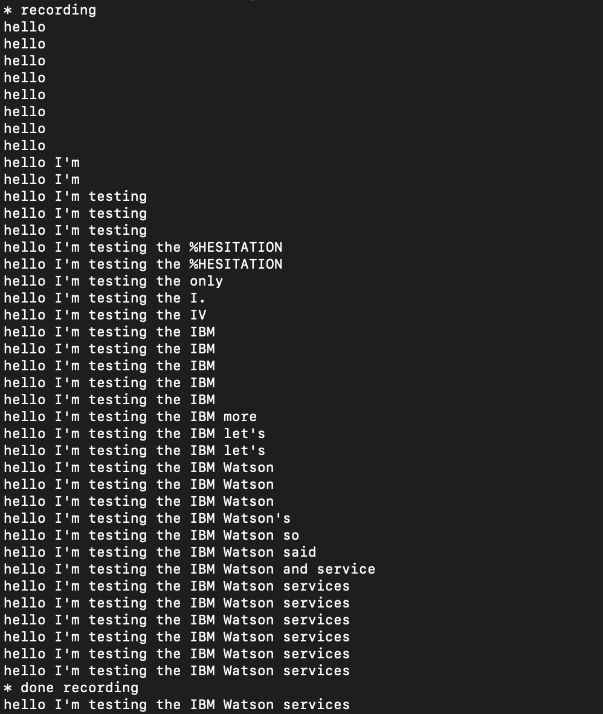

# IBM-Watson-STT-TTS


---------------------
 IBM Watson -Speech to text- tutorial for Mac
--------------------
1. First check your python version, in Terminal type ` python --version`
2. Download Home-brew, to download the last version for python.
3. Follow the rest of the steps to download python here [Set-Python3](https://dev.to/malwarebo/how-to-set-python3-as-a-default-python-version-on-mac-4jjf) .
4.  Setup Watson STT Service by Going  to [IBM-Cloud](https://cloud.ibm.com/catalog) 
    * Search for Speech to text service and click on it, select a Location, select a plan, then create the service.
    * Go to Service credentials , in **Auto-generated service credentials** copy the APIKEY and the RESION, because we gonna need it to setup the service.
5. Clone Live STT Code from: [GitHub: watson-streaming-stt](https://github.com/IBM/watson-streaming-stt)
      * in Terminal type `git clone https://github.com/IBM/watson-streaming-stt `
      * open it inside any code editor. 
6. Install the dependencies which is in **watson-streaming-stt** inside **requirements.txt**
    * type ` pip3 install -r requirements.txt`
7. Update setup/config with APIkey
     * Change name of file speech.cfg.examples by deleting .examples to avoid any error and save it.
     * Past the APIKEY and the RESION  that we copied in **step 4** and save it.
8. Now we gonna Run Live transcription by the following command ` python3 transcribe.py -t 4` 
     * 4 >it's the time by seconds to record your talk.
*The output should be like this*

----------------
IBM Watson -Text to Speech-
----------------
1. Setup Watson TTS Service by Going  to [IBM-Cloud](https://cloud.ibm.com/catalog)
    * Search for Speech to text service and click on it, select a Location, select a plan, then create the service.
    * Go to Service credentials , in **Auto-generated service credentials** copy the APIKEY and the RESION, because we gonna need it to setup the service.
2. Install the dependencies by, ```pip3 install ibm_watson ```
3. Setup TTS service with APIKEY & URL
4. Convert the text with a basic Language Model.
5. You can use some help from **Helpful Resources** section down here.
----------------
 The Problems I Faced
----------------
* I faced a problem during installing python :` Error: The 'brew link' step did not complete successfully`
So I overwrite all conflicting files by
  `brew link --overwrite python@3.9 ` 

* The second problem which toke me a lot of time to solve it is pip command, the solution that I found after a lot of searching was,
Re-install Xcode command line by these commands , 
```sudo rm -rf /Library/Developer/CommandLineTools
xcode-select --install 
————————— 
brew remove portaudio
brew install portaudio
pip3 install pyaudio 
```


---------------
 Helpful Resources
---------------
* [GitHub: python-sdk](https://github.com/watson-developer-cloud/python-sdk)
* [GitHub: RealTimeSpeechToText](https://github.com/nicknochnack/RealTimeSpeechToText)
* [IBM-STT-Doc](https://cloud.ibm.com/docs/speech-to-text/websockets.html#websockets)
* [IBM-TTS-Doc](https://cloud.ibm.com/apidocs/text-to-speech?code=python#getpronunciation)
